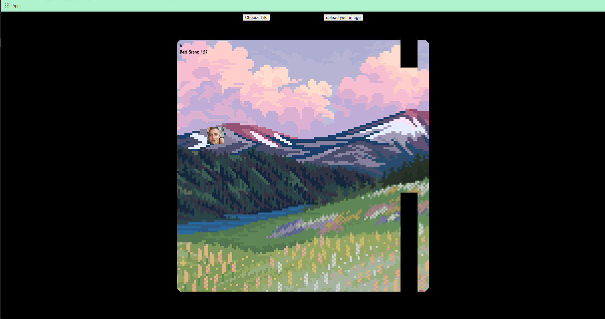

# ADE-BIRD
## ! WELCOME FROM 7WDEV(Ade Issawe) !

#### How To Use?
1-install the tutorial.html file from here-github !

2-fill the required informaition in the code (as FireBase and Images) !
```
var firebaseConfig =
        {
            apiKey: "your firebase api key",
            authDomain: "your firebase auth domain",
            projectId: "your firebase project id",
            storageBucket: "your firebase storage bucket",
            messagingSenderId: "yours...",
            appId: "yours...",
            measurementId: "yours..."
        };
```
```
 function uploadPressed()
          {
              firebase.storage().ref("your path").put(file).then(function()
                                                                        {
                                                                            console.log("upload success");
                                                                            firebase.storage().ref("your path").getDownloadURL().then(urrl => { flappy.src = urrl; });
                                                                        });
          }
```
```
const flappy = new Image();
flappy.src = "your flappy image src";
const img = new Image();
img.src = "your background image src";
```
3-enjoy !

I just coded this for fun :], Supported Browsers : Chrome, IE, Microsoft Edge,

Simple flappy bird game with custom skins coded using HTML,JS,CSS and it uses FIREBASE for storing data.

Try Out The Game : [link](#)





#### Info
Name: SYFO-AI

Type: Web Game

Author: 7Wdev

Version: 1.0.0

All copyrights are reserved!

Feel free to edit the code, feel free to contribute...

Desctription: Simple Flappy Bird Game Code For Beginners...

